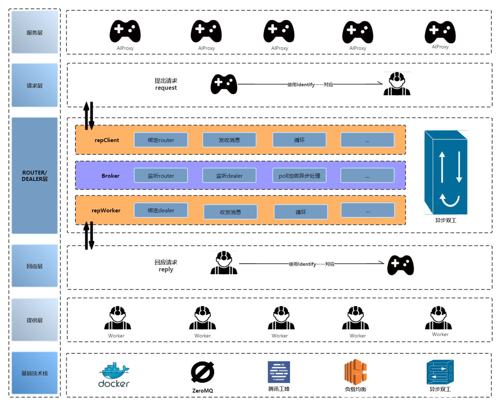
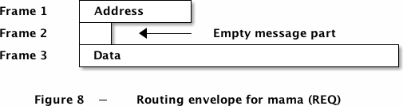

# 使用文档

> 下面所有文档，皆以`./cpp`文件夹下项目为主。

## 1. 项目整体架构图



## 2. 项目的优势

ZeroMQ提供的ROUTER/DEALER组合模式，可以轻松搭建一个高性能异步的C/C++后台服务框架。ROUTER可以高效的接收客户端的请求，而DEALER可以负载均衡的调度后端Worker工作。当客户端的请求特别多，后端Worker处理不过来，需要增加 Worker的时候，也非常简单，新加入的Worker直接Connect到DEALER即可。因此，项目的可维护性大大提高。

## 3. 各文件作用

* `broker.cpp`：使用自带的`zmq_poll`来管理ZMQ_ROUTER和ZMQ_DEALER套接字的事件
* `brokerProxy.cpp`：优化了的`broker.cpp`，自行实现`zmq_poll`
* `reqClient.cpp`：模拟`AIProxy`提出请求
* `repWorker.cpp`：模拟项目后台处理请求数据

## 4. 项目启动流程

### 4.1 准备工作

#### 4.1.1 拉取docker环境

```bash
docker pull hub.oa.com/minigo-ai/zmqrtdealer:latest
```

#### 4.1.2 clone项目代码

```bash
git clone https://github.com/fuujiro/zmqRouter
```

#### 4.1.3 挂载docker

```bash
# 找到clone的zmqRouter文件夹下
PS C:\Users\jarryfeng\Documents\zmqRouter> pwd
C:\Users\jarryfeng\Documents\zmqRouter
# 例为Windows下的挂载操作，其他系统命令一致，但路径方式需要自行改动
docker run -ti --rm --net=host -v "//C/Users/jarryfeng/Documents/zmqRouter/cpp:/root/zmqRouter:rw" hub.oa.com/minigo-ai/zmqrtdealer /bin/bash
# 执行见到如下命令，即成功
[root@docker-desktop /]
# 进入项目
cd ~/zmqRouter/cpp
```

### 4.2 `broker.cpp`

这个很关键，起着承上启下的作用，通过`ZMQ_ROUTER`和`ZMQ_DEALER`套接字来绑定上下文，当`ZMQ_POLL`里有请求端或服务端接入后，可以理解成`epoll`模型，遍历连接上的套接字的消息，根据`identify`一一建立连接并开始通信。

```bash
# 编译命令
gcc broker.cpp -o broker -lzmq
# 运行命令（前面ip：port为router监听，后面ip：port为dealer监听）
./broker 127.0.0.1 9090 127.0.0.1 9091
Current 0MQ version is 4.3.5
===========================================

[1611822183] router bind tcp://127.0.0.1:9090 ok.
[1611822183] dealer bind tcp://127.0.0.1:9091 ok.
[1611822184] zmq_poll rc = 0
[1611822185] zmq_poll rc = 0
```

从日志可以看到，`broker`已经正常启动了，不过目前暂时没有请求进来，所以都是zmq_poll超时醒来（rc = 0，意味着没有任何事件到来。）

`brokerProxy.cpp`与其类似，不再赘述。

### 4.3 `repWorker.cpp`

为了方便演示和学习，这里采用另外一个进程的方式。而且这样的好处是，可以启动任意多个Worker，连接到上面的broker的DEALER中。

ZMQ_REP套接字，其实就是一个“应答”，即，把应答数据回复给ZMQ_REQ，他们是严格的一问一答的方式。不过组合上 ZMQ_ROUTER，ZMQ_DEALER模式后，后台Worker不再是服务的死穴，可以通过横向扩展多个Worker来提高处理ZMQ_REQ的能力。（当然加上zmq_poll这种reactor多路复用机制性能更佳！）

```bash
# 编译命令
gcc repWorker.cpp -o repWorker -lzmq
# 运行命令（绑定dealer端口，1000为该worker的id，可自行改动）
./repWorker 127.0.0.1 9091 1000
Current 0MQ version is 4.3.5
===========================================

worker zmq_connect tcp://127.0.0.1:9091 done!
```

另开一个终端运行：

```bash
# 运行命令（绑定dealer端口，2000为该worker的id，可自行改动）
./repWorker 127.0.0.1 9091 2000
Current 0MQ version is 4.3.5
===========================================

worker zmq_connect tcp://127.0.0.1:9091 done!
```

随着worker到位，整个后台服务框架就搞定了。

### 4.4 `reqClient.cpp`

诚如上面所说的，ZMQ_REQ是“问”的套接字，它需要“答”套接字（ZMQ_REP）。不过目前ZMQ_REP已经被 ROUTER/DEALER华丽的包装成高富帅了。ZMQ_REQ只能通过联系ROUTER，然后由这个ROUTER/DEALER组成的broker帮忙传递到ZMQ_REP了，然后再默默的期待ROUTER传递ZMQ_REQ的“答复”。

```bash
# 编译命令
gcc reqClient.cpp -o reqClient -lzmq
# 运行命令（绑定dealer端口，1为该Client的id，可自行改动）
./reqClient 127.0.0.1 9090 1
Current 0MQ version is 4.3.5
===========================================

client zmq_connect tcp://127.0.0.1:9090 done!
[1611824478] send request(index=1&cmd=hello&time=1611824478) to server, rec = 33, request.len = 33
[1611824478] recv reply(worker=1000&result=world&time=1611824478) from server, rec = 40, reply.len = 40
[1611824478] --------------------------

[1611824481] send request(index=1&cmd=hello&time=1611824481) to server, rec = 33, request.len = 33
[1611824481] recv reply(worker=2000&result=world&time=1611824481) from server, rec = 40, reply.len = 40
[1611824481] --------------------------
```

就是这么简单，我们的客户端正常的发请求到后端，并且得到了应答.

那么broker那边的日志是如何呢？

```bash
[1611824476] zmq_poll rc = 0
[1611824477] zmq_poll rc = 0
[1611824478] zmq_poll rc = 0
[1611824478] zmq_poll rc = 1
[1611824478] zmq_poll catch one router event!
[1611824478] router deliver request to dealer. rc = 5, more = 1
[1611824478] router deliver request to dealer. rc = 0, more = 1
[1611824478] router deliver request to dealer. rc = 33, more = 0
[1611824478]----------DoRouter----------

[1611824478] zmq_poll rc = 1
[1611824478] zmq_poll catch one dealer event!
[1611824478] dealer deliver reply to router. rc = 5, more = 1
[1611824478] dealer deliver reply to router. rc = 0, more = 1
[1611824478] dealer deliver reply to router. rc = 40, more = 0
[1611824478]----------DoDealer----------

[1611824479] zmq_poll rc = 0
[1611824480] zmq_poll rc = 0
[1611824481] zmq_poll rc = 1
[1611824481] zmq_poll catch one router event!
[1611824481] router deliver request to dealer. rc = 5, more = 1
[1611824481] router deliver request to dealer. rc = 0, more = 1
[1611824481] router deliver request to dealer. rc = 33, more = 0
[1611824481]----------DoRouter----------

[1611824481] zmq_poll rc = 1
[1611824481] zmq_poll catch one dealer event!
[1611824481] dealer deliver reply to router. rc = 5, more = 1
[1611824481] dealer deliver reply to router. rc = 0, more = 1
[1611824481] dealer deliver reply to router. rc = 40, more = 0
[1611824481]----------DoDealer----------
```

repWorker的工作情况：

截取一段日志，可见repWorker正在热火朝天的工作中，只需要专注的做自己的工作就可以了，其他的如何应答客户端，完全不用担心！

```bash
[1611824478] recv request(index=1&cmd=hello&time=1611824478) from client, rec = 33, request.len = 33
[1611824478] send reply(worker=1000&result=world&time=1611824478) to client, rec = 40, reply.len = 40
[1611824478]------------------------

[1611824484] recv request(index=1&cmd=hello&time=16118244841824478) from client, rec = 33, request.len = 40
[1611824484] send reply(worker=1000&result=world&time=1611824484) to client, rec = 40, reply.len = 40
[1611824484]------------------------
```

## 5. 总结

第一次接触ZeroMQ，用简单的代码就可以写出了一个高性能的异步后台服务框架，但还是可以探索一下ZeroMQ的ROUTER/DEALER模式。

1、客户端(ZMQ_REQ)发送请求到ROUTER后，ROUTER是会对客户端进行身份表示的，正式因为有这个身份标示，所以ROUTER才有能力正确的把应答数据准确的传递到来源的客户端。

现在可以回答一下上文的一个思考题了—-ROUTER传递的3帧数据到底是什么数据：

1. 第一帧是ROUTER自己加上的消息，这个是ROUTER对ZMQ_REQ所做的一个身份标识。说到身份标识，这里就引入到两种套接字。

    一种叫做临时套接字，另外一种叫做永久套接字，他们的区别仅仅是是否使用ZMQ_IDENTITY。

    没使用的即默认为临时套接字，我的这个文章里面的例子就是一个临时套接字。对于临时套接字，ROUTER会为它生成一个唯一的UUID，所以可以看到第一帧的长度为5，正是这个UUID。

    而使用如下方式设定的套接字，则称为永久套接字。如果这样设置，那第一帧收到的消息长度就是13，而ROUTER也会直接使用`www.qq.com`这个身份来标识这个客户端。

    zmq_setsockopt(req, ZMQ_IDENTITY, “www.qq.com”, 13);


2. 第二帧是一个空帧，这是由REQ加上去的。可以理解为一个分隔符，当ROUTER遇到这个空帧后，就知道下一帧就是真正的请求数据了，这在多种组合模型里面尤其有用。

 

3. 第三帧显然就是真正的请求数据了。这里的例子比较简单，复杂的例子，客户端可能会通过ZMQ_SNDMORE来发送多帧数据。如果是这样，那ROUTER还会继续收到第四帧，第五帧。。。数据的。

    如图所示：

    
 

2、REQ到达ROUTER，ROUTER会公平排队，并公平的将REQ发往后端。但当后端能力不足的时候，导致ROUTER派发太慢的时候，ROUTER进入高水位的时候，ROUTER会丢弃掉消息的。所以得注意监控后台服务的性能。


3、DEALER会负载均衡的将任务派发后连接到它的各个工作Worker。至于这个负载均衡的算法，可以自行提供代码支持，也可用默认的，有时间再补充负载均衡的功能！

