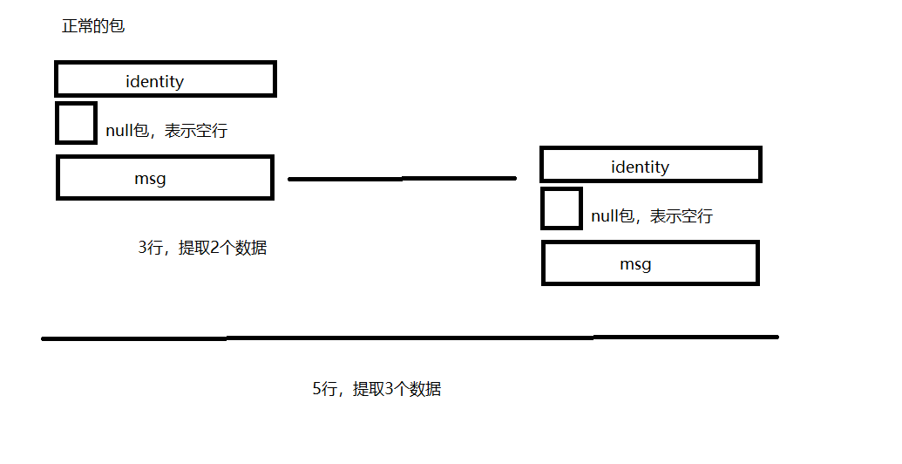

### 0. 架构

AIProxy(c++) - router(py) - worker(py) - zmq2zmq(c++)

### 1. pull docker

hub.oa.com/minigo-ai/zmqpycpp:latest

### 2. 运行

```bash
cd zmqRouter/pyCppV2

# 先跑router.py
python3.6 router.py

# 再跑./clien可执行文件
./client
```

### 3. 自行编译文件（可选）

```bash
# 编译client.cpp
g++ client.cpp -o client -lzmq

# 编译workerEntity.cpp成workerEntity.so链接库
g++ -std=c++11 --shared -Wl,-soname,workerEntity -o workerEntity.so -fPIC workerEntity.cpp

```

### 4. 笔记

#### 4.1 包结构

